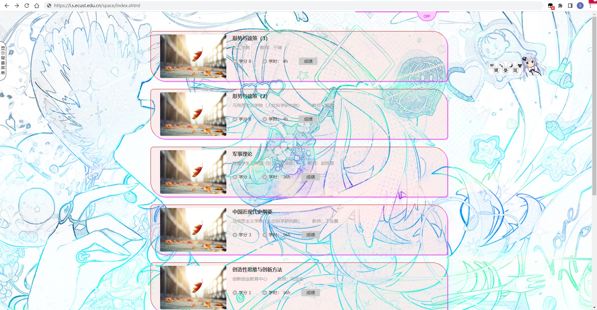
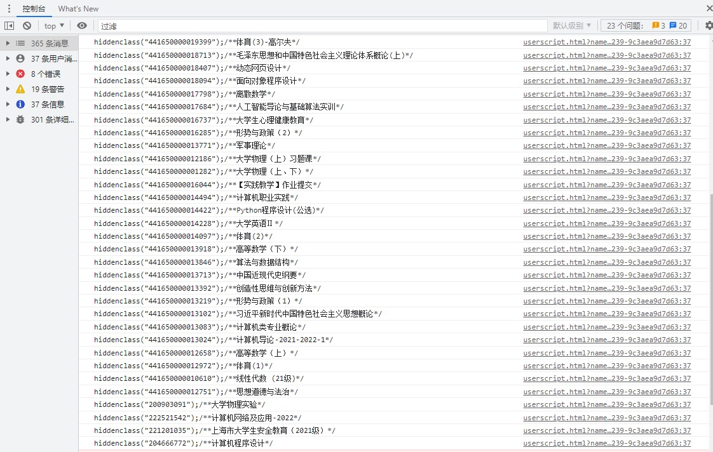

# 华东理工大学本研——课程折叠机
> *这个脚本同时会让你的课程边框变得花里胡哨，*  
> *我个人是挺喜欢这样的，但当然如果你不喜欢这个样子,*  
> *可以留言私信我，或者自己动手丰衣足食。*
## 界面效果：


**本界面同时使用了另一个简化界面和添加背景的脚本**

## 使用方法：
第一次运行脚本后，按`f12`打开开发者工具,或鼠标右键，在菜单中选择“检查”来打开开发者工具。  
在开发者工具中选中控制台后可以看到许多行的代码：  

选中这些代码，通过文本工具修改为如下形式：  
```javascript
hiddenclass("441650000020094");/**形势与政策（3）*/
hiddenclass("441650000018713");/**毛泽东思想和中国特色社会主义理论体系概论(上)*/
hiddenclass("441650000016285");/**形势与政策（2）*/
hiddenclass("441650000013771");/**军事理论*/
hiddenclass("441650000013918");/**高等数学（下）*/
hiddenclass("441650000013713");/**中国近现代史纲要*/
hiddenclass("441650000013392");/**创造性思维与创新方法*/
hiddenclass("441650000013219");/**形势与政策（1）*/
hiddenclass("441650000013102");/**习近平新时代中国特色社会主义思想概论*/
hiddenclass("441650000012658");/**高等数学（上）*/
hiddenclass("441650000012751");/**思想道德与法治*/`
```
将他们粘贴到脚本的相应位置，就可以屏蔽相应课程。  
如果不想屏蔽某些课程，可以在前面加上`//`来注释掉这一行内容。
```javascript
//hiddenclass("441650000020094");/**形势与政策（3）*/
hiddenclass("441650000018713");/**毛泽东思想和中国特色社会主义理论体系概论(上)*/
//hiddenclass("441650000016285");/**形势与政策（2）*/
hiddenclass("441650000013771");/**军事理论*/
hiddenclass("441650000013918");/**高等数学（下）*/
hiddenclass("441650000013713");/**中国近现代史纲要*/
hiddenclass("441650000013392");/**创造性思维与创新方法*/
//hiddenclass("441650000013219");/**形势与政策（1）*/
hiddenclass("441650000013102");/**习近平新时代中国特色社会主义思想概论*/
hiddenclass("441650000012658");/**高等数学（上）*/
hiddenclass("441650000012751");/**思想道德与法治*/`
```
像这样子，就可以让这些课程中只显示形势与政策的内容。
## 最后：
说到底，这个脚本其实是我个人娱乐用的。但是不上传的话，几个终端同步脚本内容就没那么方便。所以我将它发布了出来。  
当然，有什么问题可以随时找我。回复可能不及时，但是看见了，我肯定会回复的。